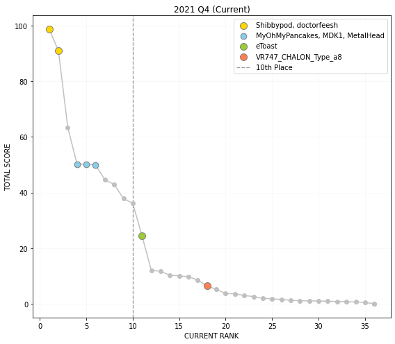
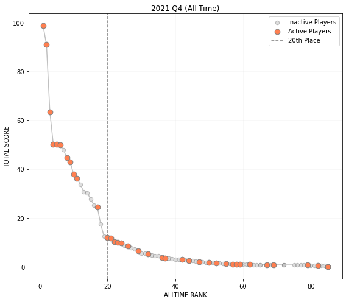

# Scoring System

The scoring system utilizes data pulled from the speedrun.com API. This is an attempt at providing a consistent metric for evaluating player performance, tracking progress, and generating community rankings. To ensure the integrity of the system, only verified NTSC runs with video proof are included in the scoring. PAL scores can also be generated as a separate product if desired. A player's total score is the sum of 5 separate scoring categories, scaled to a maximum possible score of 100. While this system would ideally be completely objective, there is some inherent subjectivity with the choice of scoring algorithms and their respective weight within the total score.  However, the algorithms and weights can easily be changed in the future based on community feedback.  In addition, the scores are relative to specific submitted times (1st place, 3rd place, 4th place, and last place) and when these times change the raw scores can also change.

## Definitions

> **IL** - individual level (time trial, in-game timer)
> 
> **RTA** - real-time attack (championship mode, external timer)
>
> **Benchmark** - For a given IL course, the benchmark is defined based on the 3rd place time, x'yy"zzz, as:  
> * x'yy"999 (for 3 Lap, Reverse)  
> * x'yy"999 (for 1 Lap where zzz $\geq$ 500)  
> * x'yy"499 (for 1 Lap where zzz < 500)
> 
> **Standard** - For a given IL course, the standard is defined as:  
> * benchmark time + 1 sec (3 Lap, Reverse)  
> * benchmark time + 0.5 sec (1 Lap)

## Algorithms

Every leaderboard run that meets the video proof requirement is considered in the scoring.  There are four progressive algorithms for IL runs and two progressive algorithms for RTA runs (the Medal Score considers both categories).  Thus an IL run can score up to 4 points in total whereas an RTA run can score up to 2 points (except All Championships, which can score up to 5 points).  For example, a perfect standard run (time = standard) would get 1 point; a perfect benchmark would get 2 points; 3rd place would get slightly over 3 points; and a world record would get 4.  

### Base Score

The Base Score determines whether or not each run has achieved a standard time.  If so, one point is awarded.  Otherwise, a score between 0 and 1 is awarded depending on how close the run is to achieving a standard time. For a given player the final score is the sum total of the points scored for each run, with a perfect score of 24.

\begin{equation}
    \sum_{i = 1}^{24}
    \begin{cases}
        0 & \text{if}~~ \text{t}_i~~ \text{does not exist}\\
        1 & \text{if}~~ \text{t}_i \leq \text{standard}_i\\
        \frac{\text{slowest}_i - \text{t}_i}{\text{slowest}_i - \text{standard}_i} & \text{otherwise}
    \end{cases}
\end{equation}

### Standard Score

The Standard Score considers only runs that have achieved at least a standard time (runs that do not meet this criteria are assigned 0 points) and determines whether those runs have achieved at least a benchmark time.  If so, one point is awarded for that run. Otherwise, a score between 0 and 1 is awarded depending on how close the run is to achieving a benchmark time.  For a given player, the final score is the sum total of the points scored for each run with a perfect score of 24.

\begin{equation}
    \sum_{i = 1}^{24}
    \begin{cases}
        0 & \text{if}~~ \text{t}_i > \text{standard}_i\\
        1 & \text{if}~~ \text{t}_i \leq \text{benchmark}_i\\
        \frac{\text{standard}_i - \text{t}_i}{\text{standard}_i - \text{benchmark}_i} & \text{otherwise}
    \end{cases}
\end{equation}

### Benchmark Score

The Benchmark Score considers only runs that have achieved at least a benchmark time (runs that do not meet this criteria are assigned 0 points) and determines whether those runs have achieved at least 3rd place.  If so, one point is awarded for that run. Otherwise, a score between 0 and 1 is awarded depending on how close the run is to achieving 3rd place.  For a given player, the final score is the sum total of the points scored for each run with a perfect score of 24.

\begin{equation}
    \sum_{i = 1}^{24}
    \begin{cases}
        0 & \text{if}~~ \text{t}_i > \text{benchmark}_i\\
        1 & \text{if}~~ \text{t}_i \leq \text{3rd place}_i\\
        \frac{\text{benchmark}_i - \text{t}_i}{\text{benchmark}_i - \text{3rd place}_i} & \text{otherwise}
    \end{cases}
\end{equation}

### Championship Score

The Championship Score assigns points based on where the run is between 1st (1 point) and last (0 points) place.  For All Championships, points scored by each run are multiplied by 4 to reflect the fact that it contains four consecutive championship runs.  For a given player, the final score is the sum total of the points scored by each run with a perfect score of 8.

\begin{equation}
    \sum_{i = 1}^{5}
    \begin{cases}
        0 & \text{if}~~ \nexists~~ \text{t}_i\\
        4\left(\frac{\text{slowest}_{i} - \text{t}_i}{\text{slowest}_{i} - \text{1st place}_i}\right) & \text{if}~~ i = \text{All Championships}\\
        \frac{\text{slowest}_{i} - \text{t}_i}{\text{1st place}_{i} - \text{1st place}_i} & \text{otherwise}
    \end{cases}
\end{equation}

### Medal Score

The Medal Score considers IL and RTA runs that have achieved 3rd place or better (runs that do not meet this criteria are assigned 0 points).  Points are assigned based on where the run is between 1st place (1 point) and 4th place (0 points).  Thus, a 3rd place finish could potentially get up to 0.99 points depending on how close it is to the world record relative to the 4th place finish. Likewise, a 3rd place finish could also get 0.01 points.  For a given player, the final score is the sum total of the points scored by each run with a perfect score of 29.

\begin{equation}
    \sum_{i = 1}^{29}
    \begin{cases}
        0 & \text{if}~~ \text{t}_i > \text{3rd place}_i\\
        \frac{\text{4th place}_i - \text{t}_i}{\text{4th place}_i - \text{1st place}_i} & \text{otherwise}
    \end{cases}
\end{equation}

### Total Score

A player's Total Score is the sum of all the scores defined above, rescaled so that a perfect score (all world records) equals 100 points.

\begin{equation}
    \frac{100}{106} \sum_{k = 1}^{5} \text{score}_k
\end{equation}


# Rankings

Scores are calculated based on all verified runs with video proof and these scores are used to generate all-time rankings.  However, in order to qualify for the current rankings, a player must have submitted a PB within the past two years.  If a player qualifies, then they are included in the rankings!  Once these algorithms are polished, rankings could be published fairly regularly.  It takes less than 15 minutes to pull the data, run the scripts, and publish the outputs. 

## Tallysheet

In addition to the rankings, a tallysheet is produced documenting the number of standards, benchmarks, and medals each player has acquired.  Hopefully someday this can be used for official achievements.

## Comparison

To demonstrate how the scoring system and rankings work, let's compare it against the most recent official rankings (2021 Q4).  Here's the official top 10:

| Rank | Player         |
| :--: | -------------- |
| 1    | Shibbypod      |
| 2    | doctorfeesh    |
| 3    | Game           |
| 4    | MDK1           |
| 5    | MyOhMyPancakes |
| 6    | MetalHead      |
| 7    | AS_Money       |
| 8    | Illudude       |
| 9    | meauxdal       |
| 10   | andypanther    |


```python
R = rankings.calc(
    DATE = '2021-12-31',
    READ = True,
    PREV = True
)
```


<div>
<style scoped>
    .dataframe tbody tr th:only-of-type {
        vertical-align: middle;
    }

    .dataframe tbody tr th {
        vertical-align: top;
    }

    .dataframe thead th {
        text-align: right;
    }
</style>
<table border="1" class="dataframe">
  <thead>
    <tr style="text-align: right;">
      <th></th>
      <th>CURRENT RANK</th>
      <th>PREVIOUS RANK</th>
      <th>ALLTIME RANK</th>
      <th>TOTAL SCORE</th>
      <th>dSCORE</th>
      <th>BASE SCORE</th>
      <th>STANDARD SCORE</th>
      <th>BENCHMARK SCORE</th>
      <th>CHAMPIONSHIP SCORE</th>
      <th>MEDAL SCORE</th>
    </tr>
    <tr>
      <th>PLAYER</th>
      <th></th>
      <th></th>
      <th></th>
      <th></th>
      <th></th>
      <th></th>
      <th></th>
      <th></th>
      <th></th>
      <th></th>
    </tr>
  </thead>
  <tbody>
    <tr>
      <th>Shibbypod</th>
      <td>1.0</td>
      <td>1.0</td>
      <td>1.0</td>
      <td>98.67</td>
      <td>2.68</td>
      <td>24.000000</td>
      <td>24.000</td>
      <td>24.000000</td>
      <td>8.00</td>
      <td>24.589010</td>
    </tr>
    <tr>
      <th>doctorfeesh</th>
      <td>2.0</td>
      <td>2.0</td>
      <td>2.0</td>
      <td>90.93</td>
      <td>2.33</td>
      <td>24.000000</td>
      <td>24.000</td>
      <td>23.701641</td>
      <td>7.46</td>
      <td>17.232846</td>
    </tr>
    <tr>
      <th>Game</th>
      <td>3.0</td>
      <td>3.0</td>
      <td>3.0</td>
      <td>63.42</td>
      <td>-2.82</td>
      <td>24.000000</td>
      <td>22.653</td>
      <td>16.993910</td>
      <td>0.00</td>
      <td>3.583871</td>
    </tr>
    <tr>
      <th>MyOhMyPancakes</th>
      <td>4.0</td>
      <td>4.0</td>
      <td>4.0</td>
      <td>50.23</td>
      <td>-1.21</td>
      <td>23.846762</td>
      <td>17.183</td>
      <td>4.779652</td>
      <td>6.98</td>
      <td>0.455378</td>
    </tr>
    <tr>
      <th>MDK1</th>
      <td>5.0</td>
      <td>11.0</td>
      <td>5.0</td>
      <td>50.15</td>
      <td>23.06</td>
      <td>18.792414</td>
      <td>17.756</td>
      <td>11.370144</td>
      <td>1.90</td>
      <td>3.344314</td>
    </tr>
    <tr>
      <th>MetalHead</th>
      <td>6.0</td>
      <td>5.0</td>
      <td>6.0</td>
      <td>49.88</td>
      <td>-0.55</td>
      <td>23.585670</td>
      <td>15.855</td>
      <td>6.497861</td>
      <td>6.77</td>
      <td>0.157143</td>
    </tr>
    <tr>
      <th>AS_Money</th>
      <td>7.0</td>
      <td>6.0</td>
      <td>8.0</td>
      <td>44.54</td>
      <td>-0.96</td>
      <td>22.930517</td>
      <td>15.813</td>
      <td>2.343464</td>
      <td>6.12</td>
      <td>0.000000</td>
    </tr>
    <tr>
      <th>meauxdal</th>
      <td>8.0</td>
      <td>7.0</td>
      <td>9.0</td>
      <td>42.92</td>
      <td>-0.51</td>
      <td>23.364402</td>
      <td>15.646</td>
      <td>3.383378</td>
      <td>3.11</td>
      <td>0.000000</td>
    </tr>
    <tr>
      <th>andypanther</th>
      <td>9.0</td>
      <td>8.0</td>
      <td>10.0</td>
      <td>37.79</td>
      <td>0.23</td>
      <td>23.108440</td>
      <td>11.220</td>
      <td>0.916713</td>
      <td>4.81</td>
      <td>0.000000</td>
    </tr>
    <tr>
      <th>Illudude</th>
      <td>10.0</td>
      <td>9.0</td>
      <td>11.0</td>
      <td>36.12</td>
      <td>0.01</td>
      <td>13.837586</td>
      <td>11.892</td>
      <td>8.353974</td>
      <td>0.91</td>
      <td>3.300626</td>
    </tr>
  </tbody>
</table>
</div>


The scoring system produces the same players in the top 10, although the order is a little different.  MDK1 and MyOhMyPancakes have swapped positions and Illudude has moved from 8th to 10th.  Both are probably directly related to lack of submissions given that they have low base and standard scores but high benchmark and medal scores.  Let's look at the tallysheet for the players whose ranking has changed:


```python
T = tallysheet.open(
    DATE = '2021-12-31',
    REGION = 'NTSC'
)
```


<div>
<style scoped>
    .dataframe tbody tr th:only-of-type {
        vertical-align: middle;
    }

    .dataframe tbody tr th {
        vertical-align: top;
    }

    .dataframe thead th {
        text-align: right;
    }
</style>
<table border="1" class="dataframe">
  <thead>
    <tr style="text-align: right;">
      <th></th>
      <th>SHEET</th>
      <th>STANDARDS</th>
      <th>BENCHMARKS</th>
      <th>BRONZE</th>
      <th>SILVER</th>
      <th>GOLD</th>
      <th>MEDALS</th>
    </tr>
    <tr>
      <th>PLAYER</th>
      <th></th>
      <th></th>
      <th></th>
      <th></th>
      <th></th>
      <th></th>
      <th></th>
    </tr>
  </thead>
  <tbody>
    <tr>
      <th>MDK1</th>
      <td>21</td>
      <td>18.0</td>
      <td>16.0</td>
      <td>3.0</td>
      <td>5.0</td>
      <td>1.0</td>
      <td>9.0</td>
    </tr>
    <tr>
      <th>MyOhMyPancakes</th>
      <td>29</td>
      <td>22.0</td>
      <td>14.0</td>
      <td>2.0</td>
      <td>0.0</td>
      <td>0.0</td>
      <td>2.0</td>
    </tr>
    <tr>
      <th>Illudude</th>
      <td>15</td>
      <td>13.0</td>
      <td>11.0</td>
      <td>3.0</td>
      <td>2.0</td>
      <td>2.0</td>
      <td>7.0</td>
    </tr>
    <tr>
      <th>meauxdal</th>
      <td>28</td>
      <td>19.0</td>
      <td>9.0</td>
      <td>0.0</td>
      <td>0.0</td>
      <td>0.0</td>
      <td>0.0</td>
    </tr>
    <tr>
      <th>andypanther</th>
      <td>29</td>
      <td>16.0</td>
      <td>4.0</td>
      <td>0.0</td>
      <td>0.0</td>
      <td>0.0</td>
      <td>0.0</td>
    </tr>
  </tbody>
</table>
</div>


Each of the players with improved rankings have a full or nearly full timesheet, while MDK1 is missing 8 submissions and Illudude is missing 14 submissions. With the difference between MDK and MyOhMyPancakes being only 0.08 points, MDK1 is probably only one top 35 submission from pulling ahead.  Given the eye test, Illudude should be ranked higher (and would be with more submissions).  Is the system flawed?  Maybe, but the advantage is that there is a simple, straightforward way for Illudude to improve their score should they care.

For the most part, we've been limited to top 10 rankings with unordered honorable mentions.  With these rankings we can look at the whole field. Here are the scores for all active players (submitted within the last 2 years).  Shibbypod and doctorfeesh are obviously way up there.  MyOhMyPancakes, MDK1, and MetalHead are neck and neck for 4th. But look at that HUGE drop off after 10th.  eToast is the only player outside of the top 10 to fully break away from the pack.  VR747_CHALON_Type_a8 is another interesting case; top 5 in RTA runs but hasn't submitted any IL runs.  Still at 18th though even with the Championship Score being weighted fairly low.


    

    


Now look at the same plot but with all-time rankings that include inactive players.  Sure seems like that steep climb starting around 12 points (20th place) is a killer.  Just playing around at this point but the data from a scoring system like this could be really fun to explore.


    

    


# Awards

Another use for this data is generating awards or showcasing runs from the past quarter. For example, comparing Q4 with rankings generated for Q3 allows us to find the most improved player and the best new player over the quarter.  The top player is simply the highest score... a formality given the rankings (but you can't have awards without an MVP).


```python
AWARDS = awards.awards(
    DATE = '2021-12-31',
    REGION = 'NTSC'
)
```


<div>
<style scoped>
    .dataframe tbody tr th:only-of-type {
        vertical-align: middle;
    }

    .dataframe tbody tr th {
        vertical-align: top;
    }

    .dataframe thead th {
        text-align: right;
    }
</style>
<table border="1" class="dataframe">
  <thead>
    <tr style="text-align: right;">
      <th></th>
      <th>PLAYER</th>
      <th>TOTAL SCORE</th>
      <th>dSCORE</th>
    </tr>
    <tr>
      <th>AWARD</th>
      <th></th>
      <th></th>
      <th></th>
    </tr>
  </thead>
  <tbody>
    <tr>
      <th>Best Player</th>
      <td>Shibbypod</td>
      <td>98.67</td>
      <td>2.68</td>
    </tr>
    <tr>
      <th>Most Improved</th>
      <td>MDK1</td>
      <td>50.15</td>
      <td>23.06</td>
    </tr>
    <tr>
      <th>Top Rookie</th>
      <td>touhu_dnb</td>
      <td>0.90</td>
      <td>NaN</td>
    </tr>
  </tbody>
</table>
</div>


# Achievements

You can also highlight achievements such as new players or players with a complete scoresheet.  This is currently in progress but hopefully it illustrates the potential.


```python
ACHIEVEMENTS = awards.achievements(
    DATE = '2021-12-31',
    REGION = 'NTSC'
)
```


<div>
<style scoped>
    .dataframe tbody tr th:only-of-type {
        vertical-align: middle;
    }

    .dataframe tbody tr th {
        vertical-align: top;
    }

    .dataframe thead th {
        text-align: right;
    }
</style>
<table border="1" class="dataframe">
  <thead>
    <tr style="text-align: right;">
      <th></th>
    </tr>
    <tr>
      <th>FIRST SUBMISSION ACHIEVEMENT</th>
    </tr>
  </thead>
  <tbody>
    <tr>
      <th>GetLow</th>
    </tr>
    <tr>
      <th>Sysynct</th>
    </tr>
    <tr>
      <th>backpain4</th>
    </tr>
    <tr>
      <th>irukan</th>
    </tr>
    <tr>
      <th>touhu_dnb</th>
    </tr>
  </tbody>
</table>
</div>


<div>
<style scoped>
    .dataframe tbody tr th:only-of-type {
        vertical-align: middle;
    }

    .dataframe tbody tr th {
        vertical-align: top;
    }

    .dataframe thead th {
        text-align: right;
    }
</style>
<table border="1" class="dataframe">
  <thead>
    <tr style="text-align: right;">
      <th></th>
    </tr>
    <tr>
      <th>COMPLETE SHEET ACHIEVEMENT</th>
    </tr>
  </thead>
  <tbody>
    <tr>
      <th>MetalHead</th>
    </tr>
    <tr>
      <th>MyOhMyPancakes</th>
    </tr>
    <tr>
      <th>Shibbypod</th>
    </tr>
    <tr>
      <th>andypanther</th>
    </tr>
    <tr>
      <th>doctorfeesh</th>
    </tr>
  </tbody>
</table>
</div>


<div>
<style scoped>
    .dataframe tbody tr th:only-of-type {
        vertical-align: middle;
    }

    .dataframe tbody tr th {
        vertical-align: top;
    }

    .dataframe thead th {
        text-align: right;
    }
</style>
<table border="1" class="dataframe">
  <thead>
    <tr style="text-align: right;">
      <th></th>
    </tr>
    <tr>
      <th>ALL STANDARDS ACHIEVEMENT</th>
    </tr>
  </thead>
  <tbody>
    <tr>
      <th>Game</th>
    </tr>
    <tr>
      <th>Shibbypod</th>
    </tr>
    <tr>
      <th>doctorfeesh</th>
    </tr>
  </tbody>
</table>
</div>


<div>
<style scoped>
    .dataframe tbody tr th:only-of-type {
        vertical-align: middle;
    }

    .dataframe tbody tr th {
        vertical-align: top;
    }

    .dataframe thead th {
        text-align: right;
    }
</style>
<table border="1" class="dataframe">
  <thead>
    <tr style="text-align: right;">
      <th></th>
    </tr>
    <tr>
      <th>ALL BENCHMARKS ACHIEVEMENT</th>
    </tr>
  </thead>
  <tbody>
    <tr>
      <th>Shibbypod</th>
    </tr>
    <tr>
      <th>doctorfeesh</th>
    </tr>
  </tbody>
</table>
</div>


<div>
<style scoped>
    .dataframe tbody tr th:only-of-type {
        vertical-align: middle;
    }

    .dataframe tbody tr th {
        vertical-align: top;
    }

    .dataframe thead th {
        text-align: right;
    }
</style>
<table border="1" class="dataframe">
  <thead>
    <tr style="text-align: right;">
      <th></th>
    </tr>
    <tr>
      <th>ALL MEDALS ACHIEVEMENT</th>
    </tr>
  </thead>
  <tbody>
    <tr>
      <th>Shibbypod</th>
    </tr>
  </tbody>
</table>
</div>


# Showcase

Finally, we could even build an algorithm to showcase the best runs of the quarter.  Here's a quick test where the highest placing runs submitted in Q4 were selected for each category. Ties were decided by some janky comparison between the median time and the world record time.  Now I know why MDK1 got the Most Improved award! Another idea could be to find the player with the greatest improvement for each course over the quarter.  This has the opportunity to recognize the work of newer players, like someone who went from a 1'09"xxx on Sunny Beach (3 Lap) in Q3 to 1'05"xxx in Q4. It's also fun because you can link the videos for those who missed seeing the run come through in the first place.


```python
BESTRUNS = awards.best_runs(
    DATE = '2021-12-31',
    REGION = 'NTSC'
)
```


<div>
<style scoped>
    .dataframe tbody tr th:only-of-type {
        vertical-align: middle;
    }

    .dataframe tbody tr th {
        vertical-align: top;
    }

    .dataframe thead th {
        text-align: right;
    }
</style>
<table border="1" class="dataframe">
  <thead>
    <tr style="text-align: right;">
      <th></th>
      <th>PLAYER</th>
      <th>LEVEL</th>
      <th>PLACE</th>
      <th>TIME</th>
      <th>VIDEO</th>
    </tr>
    <tr>
      <th>BEST RUNS</th>
      <th></th>
      <th></th>
      <th></th>
      <th></th>
      <th></th>
    </tr>
  </thead>
  <tbody>
    <tr>
      <th>3 Lap</th>
      <td>MDK1</td>
      <td>Sunny Beach</td>
      <td>2</td>
      <td>1'03"273</td>
      <td>https://youtu.be/r54GyglE5nc</td>
    </tr>
    <tr>
      <th>1 Lap</th>
      <td>MDK1</td>
      <td>Sunny Beach</td>
      <td>3</td>
      <td>0'20"182</td>
      <td>https://youtu.be/7IXcMzO3sWY</td>
    </tr>
    <tr>
      <th>Reverse</th>
      <td>MDK1</td>
      <td>Sunset Bay</td>
      <td>1</td>
      <td>1'07"976</td>
      <td>https://youtu.be/FpOKDjDX_-8</td>
    </tr>
    <tr>
      <th>RTA</th>
      <td>MDK1</td>
      <td>Championship Normal</td>
      <td>3</td>
      <td>9'24"000</td>
      <td>https://youtu.be/7u37I2mJWGw</td>
    </tr>
  </tbody>
</table>
</div>


